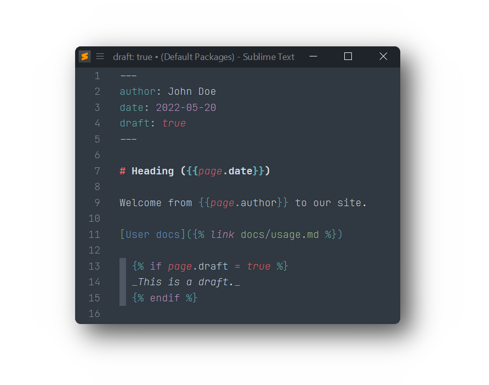

# Liquid/Jekyll syntax for Sublime Text

Provides syntax highlighting for HTML and Markdown files with [Shopify Liquid](https://shopify.github.io/liquid/) and [Jekyll](https://jekyllrb.com/docs/liquid/) template tags.

For working with [Jekyll](https://jekyllrb.com), this package also provides proper syntax highlighting for yaml front matter.

## Usage

To enable the syntax, select `Liquid > HTML (Liquid)` or `Liquid > Markdown (Liquid)` from syntax selection menu or via Command Palette.

To always open your templates with this syntax, use the `Open all with current extension as ...` option, and select the proper Liquid syntax.
