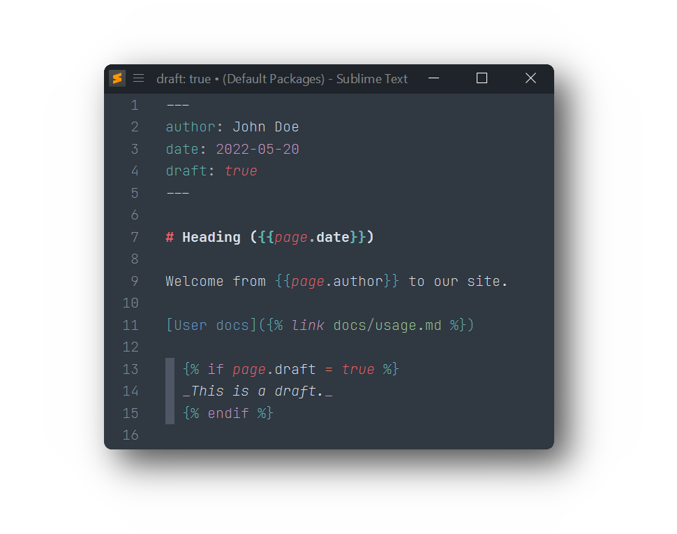

# Liquid/Jekyll syntax for Sublime Text

Provides syntax highlighting for HTML and Markdown files with [Shopify Liquid](https://shopify.github.io/liquid/) and [Jekyll](https://jekyllrb.com/docs/liquid/) template tags.

For working with [Jekyll](https://jekyllrb.com), this package also provides proper syntax highlighting for yaml front matter.

## Installation

### Package Control

The easiest way to install is using [Package Control](https://packagecontrol.io). It's listed as `Liquid`.

1. Open `Command Palette` using <kbd>ctrl+shift+P</kbd> or menu item `Tools → Command Palette...`
2. Choose `Package Control: Install Package`
3. Find `Liquid` and hit <kbd>Enter</kbd>

### Manual Install

1. Download appropriate [Liquid-2.0.0-st4xxx.sublime-package](https://github.com/SublimeText/Liquid/releases) for your Sublime Text build.  
   _The `st4xxx` suffix denotes the least required ST build for the sublime-package to work._
2. Rename it to _Liquid.sublime-package_
3. Copy it into _Installed Packages_ directory

> To find _Installed Packages_...
>
> 1. call _Menu > Preferences > Browse Packages.._
> 2. Navigate to parent folder

## Usage

To enable the syntax, select `Liquid > HTML (Liquid)` or `Liquid > Markdown (Liquid)` from syntax selection menu or via Command Palette.

To always open your templates with this syntax, use the `Open all with current extension as ...` option, and select the proper Liquid syntax.

## Troubleshooting

Liquid extends Sublime Text's HTML, Markdown, CSS and JavaScript, syntax definitions.

If Liquid syntax highlighting doesn't work and console displays syntax errors, 

1. check if required bundled packages are enabled.
2. remove any out-dated syntax override.
   
### Enable bundled packages

1. Open `Command Palette` using <kbd>ctrl+shift+P</kbd> or menu item `Tools → Command Palette...`
2. Choose `Package Control: Enable Packages`
3. Find `CSS` and hit <kbd>Enter</kbd>
4. Repeat the steps for `JavaScript`, `HTML` and `Markdown`

### Remove overrides

1. call _Menu > Preferences > Browse Packages.._
2. Look for _CSS_, _HTML_, _JavaScript_, _Markdown_ folder
3. Remove them or at least delete any syntax definition in them
